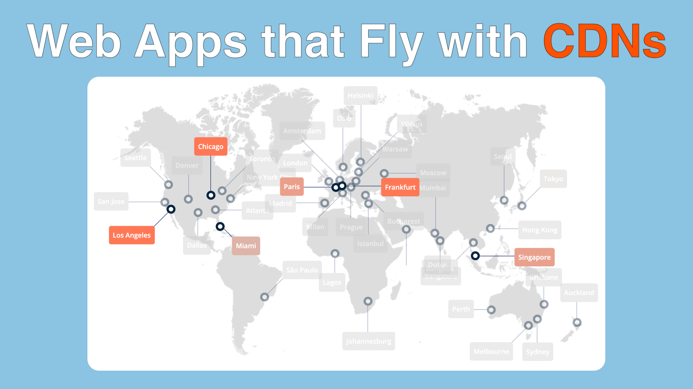

# Fast Python Webapps with CDNs course

## Large files used during the course

During the course, we need some large data file to demonstrate sharing large, user-generated content.
We'll use a couple of YouTube videos I've created for the podcast over the years. They are not
required for the demo app to work (but a few video plays will fail without them). Download them here:

[
self-hosted-videos.zip](
self-hosted-videos.zip)

